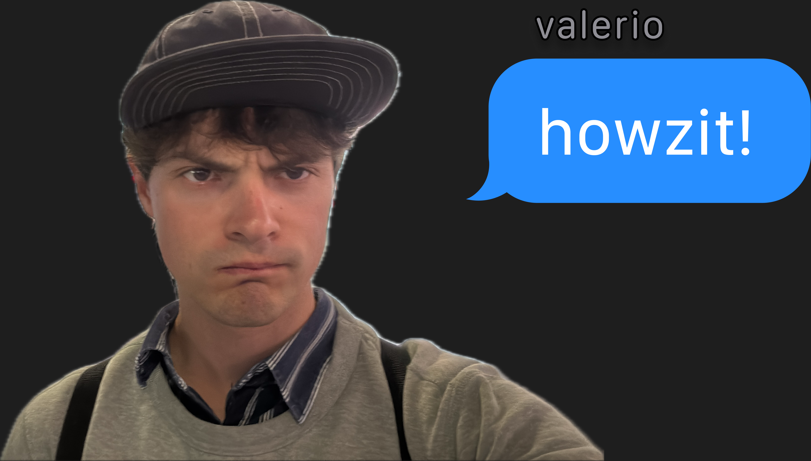

  

 

## 👋 &nbsp; about me

🇿🇦 &nbsp; south african  
🎓 &nbsp; student @ bocconi university, milan  
🧠 &nbsp; into nlp, ai tooling, and turning messy data into clean, durable formats  
⚖️ &nbsp; building **legalize-za** — south african law as version-controlled markdown  

## 📌 &nbsp; projects

| repo | what it is |
|------|------------|
| [`dog-whistle-detection`](https://github.com/calerio/dog-whistle-detection) | bocconi nlp project — dog-whistle disambiguation on the *silent_signals* corpus |
| [`claude-skills`](https://github.com/calerio/claude-skills) | custom skills for claude code & ai coding assistants i tinker with |
| [`Mini-Briscola`](https://github.com/calerio/Mini-Briscola) | briscola — the classic italian card game, in code |

## 🔗 &nbsp; links

💼 &nbsp; linkedin: [`valerioc`](https://www.linkedin.com/in/valerioc)  
📸 &nbsp; instagram: [`@va1eriocosta`](https://instagram.com/va1eriocosta)  
🤗 &nbsp; hugging face: [`calerio`](https://huggingface.co/calerio)  

 

  <i>feel free to fork, remix, and build on anything here.</i>

