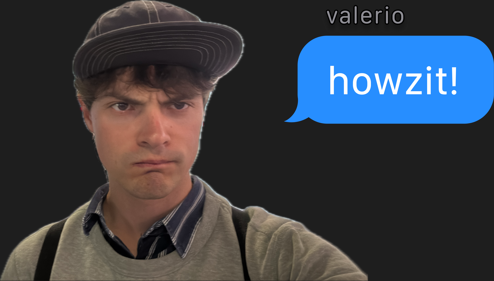

  

 

i'm valerio, a south african studying at bocconi in milan. mostly i do nlp and data work, and every now and then i build a small site because i wanted to see something on a map or keep something from getting lost.

i write python most days, plus some typescript, sql and swift. for ml it's pytorch, hugging face, spacy, scikit-learn, pandas and numpy, usually in a jupyter notebook.

### things i've made

- [pokemon-tcg-pocket-deck-builder](https://github.com/calerio/pokemon-tcg-pocket-deck-builder): build a pokémon tcg pocket deck and get the qr code the game scans ([try it](https://calerio.github.io/pokemon-tcg-pocket-deck-builder/))
- [western-cape-valuations](https://github.com/calerio/western-cape-valuations): a map of municipal property valuations across the western cape ([live site](https://calerio.github.io/western-cape-valuations/))
- [t812-archive](https://github.com/calerio/t812-archive): polaroids, letters and memories from flat t812 ([live site](https://calerio.github.io/t812-archive/))
- [dog-whistle-detection](https://github.com/calerio/dog-whistle-detection): my bocconi nlp project on disambiguating dog whistles in the *silent_signals* corpus
- [claude-skills](https://github.com/calerio/claude-skills): skills for claude code that i tinker with
- [Mini-Briscola](https://github.com/calerio/Mini-Briscola): briscola, the italian card game

### elsewhere

[linkedin](https://www.linkedin.com/in/valerioc) · [instagram (@va1eriocosta)](https://instagram.com/va1eriocosta) · [hugging face](https://huggingface.co/calerio)
